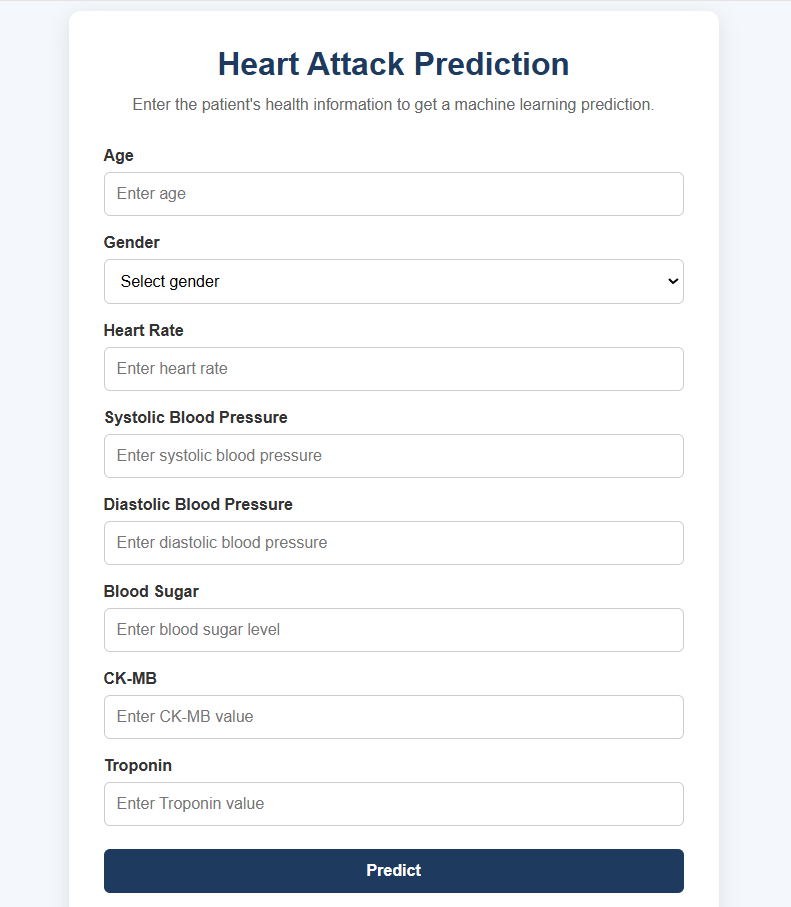
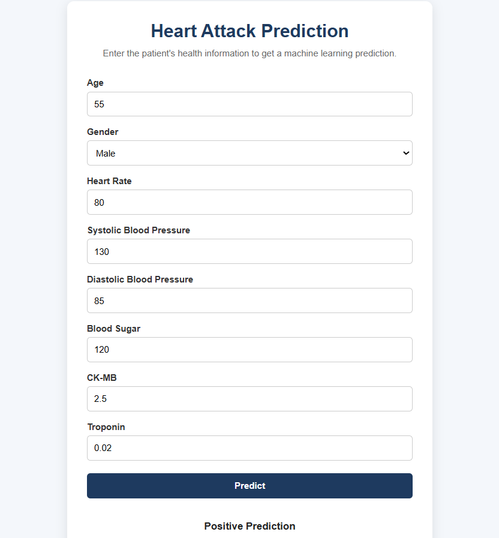
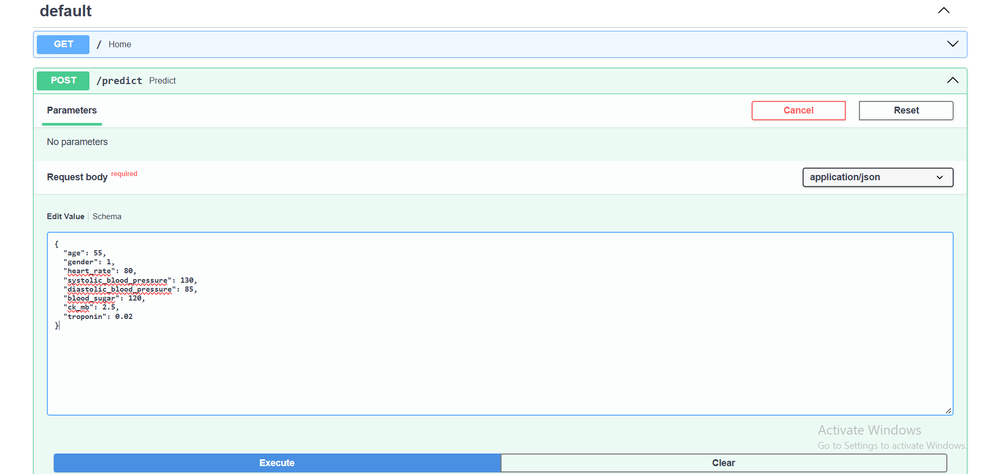
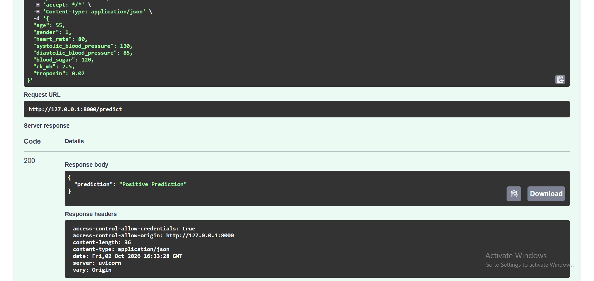

# Heart Attack Prediction Using Machine Learning

A machine learning project that analyzes cardiovascular health parameters and predicts a **positive or negative heart attack-related result** using multiple machine learning algorithms.

The project also includes a simple **web application** built with HTML, CSS, JavaScript, and FastAPI that allows users to enter patient information and receive a prediction from the trained Random Forest model.

---

## 📌 Project Overview

Heart disease is an important health concern, and machine learning can be used to explore patterns in medical datasets.

In this project, different machine learning algorithms are trained and compared using cardiovascular health parameters such as:

* Age
* Gender
* Heart Rate
* Systolic Blood Pressure
* Diastolic Blood Pressure
* Blood Sugar
* CK-MB
* Troponin

Several machine learning approaches are evaluated using **Accuracy, Precision, Recall, and F1 Score**.

A Random Forest model is then integrated into a FastAPI backend and connected to a simple frontend for interactive predictions.

---

## 📊 Dataset

The dataset contains **1,319 patient records** and 9 columns.

### Features

| Feature                  | Description                          |
| ------------------------ | ------------------------------------ |
| Age                      | Patient's age                        |
| Gender                   | Patient's gender                     |
| Heart rate               | Heart rate of the patient            |
| Systolic blood pressure  | Systolic blood pressure              |
| Diastolic blood pressure | Diastolic blood pressure             |
| Blood sugar              | Blood sugar level                    |
| CK-MB                    | CK-MB measurement                    |
| Troponin                 | Troponin measurement                 |
| Result                   | Target variable: Positive / Negative |

The dataset is used for educational machine learning experimentation.

---

## 🤖 Machine Learning Models

The following approaches were implemented and compared:

1. Logistic Regression
2. Ridge Regression
3. Lasso Regression
4. Gaussian Naive Bayes
5. Support Vector Machine
6. Random Forest
7. Gaussian Naive Bayes with PCA
8. Neural Network

### Additional Techniques

* Label Encoding
* Train-Test Split
* Feature Scaling
* Principal Component Analysis (PCA)
* Cross-Validation
* Confusion Matrix
* Model Performance Comparison

Ridge and Lasso were included as baseline regression approaches for comparison with classification algorithms.

---

## 📈 Evaluation Metrics

The models were evaluated using:

* Accuracy
* Precision
* Recall
* F1 Score
* Confusion Matrix

These metrics provide different views of model performance rather than relying only on accuracy.

---

## 🏆 Model Performance

| Model                      | Accuracy | Precision | Recall | F1 Score |
| -------------------------- | -------: | --------: | -----: | -------: |
| Logistic Regression        |   79.92% |    82.63% | 85.19% |   83.89% |
| Ridge Regression           |   70.45% |    71.43% | 86.42% |   78.21% |
| Lasso Regression           |   71.21% |    71.29% | 88.89% |   79.12% |
| Gaussian Naive Bayes       |   69.70% |    98.81% | 51.23% |   67.48% |
| Support Vector Machine     |   81.06% |    86.36% | 82.10% |   84.18% |
| Random Forest              |   98.48% |    98.77% | 98.77% |   98.77% |
| Gaussian Naive Bayes + PCA |   61.74% |    63.56% | 88.27% |   73.90% |
| Neural Network             |   74.24% |    76.40% | 83.95% |   80.00% |

The results represent performance on the project's test dataset and should not be interpreted as clinical performance.

---

## 🌐 Web Application

The project includes a simple web interface that connects the trained Random Forest pipeline to a FastAPI backend.

### Application Flow

```text
User enters patient information
            ↓
      HTML / CSS / JavaScript
            ↓
        FastAPI API
            ↓
   StandardScaler + Random Forest
            ↓
        Model Prediction
            ↓
     Prediction displayed
```
---

## 🖥️ Application Screenshots

### 1. Prediction Interface



The frontend allows users to enter the required patient information.

### 2. Prediction Result



The frontend displays the prediction returned by the FastAPI backend.

### 3. FastAPI Swagger Documentation



The FastAPI Swagger interface provides interactive API documentation and shows the available endpoints.

### 4. API Prediction Response



The /predict endpoint returns the machine learning prediction after receiving the patient data.

---

### Frontend

Built using:

* HTML
* CSS
* JavaScript

The frontend collects the following 8 inputs:

* Age
* Gender
* Heart Rate
* Systolic Blood Pressure
* Diastolic Blood Pressure
* Blood Sugar
* CK-MB
* Troponin

### Backend

Built using:

* Python
* FastAPI
* Uvicorn
* Pydantic
* NumPy
* Joblib

The backend provides:

```text
GET  /
POST /predict
```

The `/predict` endpoint receives the patient information and passes it through the saved machine learning pipeline.

---

## 🧠 Machine Learning Pipeline

The Random Forest model is saved together with the feature-scaling step using a Scikit-learn pipeline.

```text
Input Features
      ↓
StandardScaler
      ↓
Random Forest Classifier
      ↓
Prediction
```

The trained pipeline is stored as:

```text
backend/random_forest_pipeline.joblib
```

This ensures that the same preprocessing used during model training is applied when making predictions through the web application.

---

## 🛠️ Technologies Used

### Programming

* Python
* HTML
* CSS
* JavaScript

### Machine Learning

* Pandas
* NumPy
* Scikit-learn
* TensorFlow / Keras

### Backend

* FastAPI
* Uvicorn
* Pydantic
* Joblib

### Visualization

* Matplotlib
* Seaborn

### Development Tools

* Jupyter Notebook
* Visual Studio Code
* Git
* GitHub

---

📁 Project Structure

```text
heart-attack-prediction/
│
├── backend/
│   ├── main.py
│   └── random_forest_pipeline.joblib
│
├── data/
│   └── Medicaldataset.csv
│
├── frontend/
│   ├── index.html
│   ├── style.css
│   └── script.js
│
├── images/
│   ├── home.png
│   ├── prediction-result.png
│   ├── swagger-api.png
│   └── swagger-api-response.png
│
├── notebooks/
│   └── heart_attack_prediction.ipynb
│
├── model_comparison_results.csv
├── requirements.txt
├── .gitignore
└── README.md
```

---

## 🚀 How to Run the Project

### 1. Clone the Repository

```bash
git clone https://github.com/subalakshmi4/heart-attack-prediction.git
```

### 2. Navigate to the Project

```bash
cd heart-attack-prediction
```

### 3. Create a Virtual Environment

```bash
python -m venv .venv
```

### 4. Activate the Virtual Environment

**Windows:**

```bash
.venv\Scripts\activate
```

### 5. Install Dependencies

```bash
pip install -r requirements.txt
```

### 6. Start the FastAPI Server

From the project root:

```bash
uvicorn backend.main:app --reload
```

The API will be available at:

```text
http://127.0.0.1:8000
```

### 7. Open the Frontend

Open:

```text
frontend/index.html
```

using VS Code Live Server.

The frontend communicates with the FastAPI backend to generate predictions.

---

##  API Endpoint

### `GET /`

Checks whether the API is running.

Example response:

```json
{
  "message": "Heart Attack Prediction API is running!"
}
```

### `POST /predict`

Accepts patient information and returns the model prediction.

Example request:

```json
{
  "age": 55,
  "gender": 1,
  "heart_rate": 80,
  "systolic_blood_pressure": 130,
  "diastolic_blood_pressure": 85,
  "blood_sugar": 120,
  "ck_mb": 2.5,
  "troponin": 0.02
}
```

Example response:

```json
{
  "prediction": "Positive Prediction"
}
```

---

## 📓 Jupyter Notebook

The complete machine learning experimentation is available in:

```text
notebooks/heart_attack_prediction.ipynb
```

The notebook includes:

* Dataset loading
* Data quality checks
* Descriptive statistics
* Target distribution
* Feature visualization
* Outlier analysis
* Data preparation
* Feature scaling
* Multiple machine learning models
* PCA
* Neural network
* Cross-validation
* Confusion matrices
* Model comparison
* Performance visualization

---

## 📄 Model Comparison Results

The final model comparison is also saved separately as:

```text
model_comparison_results.csv
```

This file contains the Accuracy, Precision, Recall, and F1 Score of the implemented models.

---

## 🎯 Learning Outcomes

Through this project, I gained practical experience with:

* Data preprocessing
* Exploratory data analysis
* Feature scaling
* Classification algorithms
* Regression baselines
* Model evaluation
* PCA
* Neural networks
* Cross-validation
* Model serialization
* REST APIs
* FastAPI
* Frontend-backend integration
* Git and GitHub

---

## ⚠️ Disclaimer

This project is intended strictly for **educational and demonstration purposes**.

The predictions generated by this application should **not** be considered medical advice, diagnosis, or treatment recommendations. The model was developed using a specific dataset and has not been validated for clinical use.


